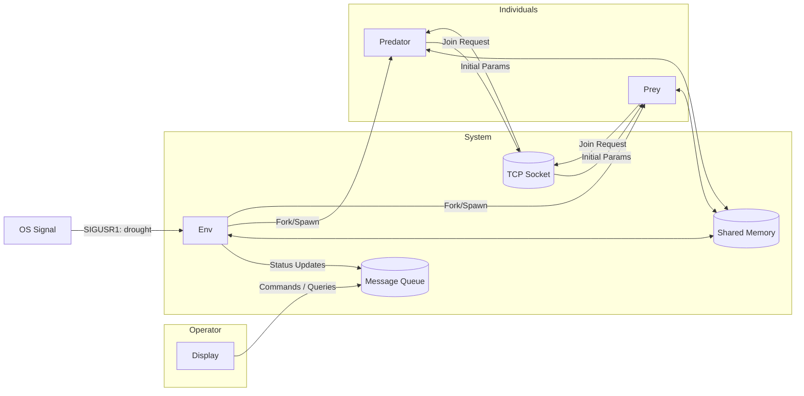

```mermaid
flowchart LR
    subgraph Operator
        Display
    end

    subgraph System
        Env
        SharedMemory[(Shared Memory)]
        MQ[(Message Queue)]
        Socket[(TCP Socket)]
    end

    subgraph Individuals
        Predator
        Prey
    end

    Display -->|Commands / Queries| MQ
    Env -->|Status Updates| MQ

    Env <--> SharedMemory
    Predator <--> SharedMemory
    Prey <--> SharedMemory

    Predator -->|Join Request| Socket
    Prey -->|Join Request| Socket
    Socket -->|Initial Params| Predator
    Socket -->|Initial Params| Prey

    OS_SIGUSR1[OS Signal] -->|SIGUSR1: drought| Env

    Env -->|Fork/Spawn| Predator
    Env -->|Fork/Spawn| Prey
```
