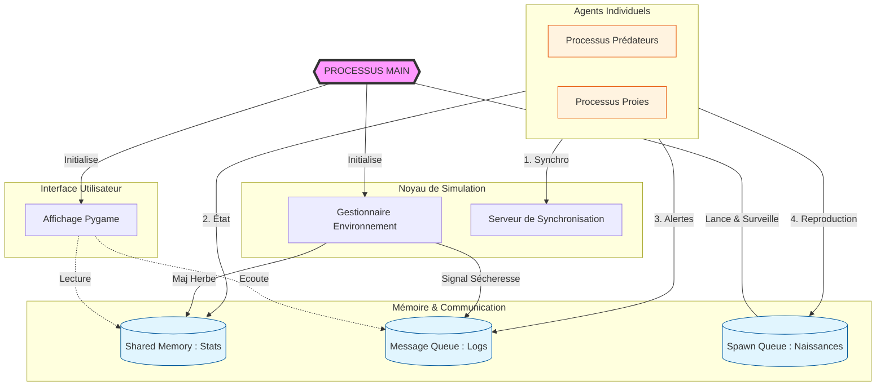

```mermaid
flowchart TB
    %% --- STYLE DES BLOCS ---
    classDef mainNode fill:#f9f,stroke:#333,stroke-width:4px
    classDef storage fill:#e1f5fe,stroke:#01579b
    classDef agents fill:#fff3e0,stroke:#e65100

    %% --- DÉFINITION DES PROCESSUS ---
    
    subgraph UI [Interface Utilisateur]
        Display[Affichage Pygame]
    end

    subgraph Core [Noyau de Simulation]
        Env[Gestionnaire Environnement]
        Socket[Serveur de Synchronisation]
    end

    subgraph Memory [Mémoire & Communication]
        SharedMemory[(Shared Memory : Stats)]
        MQ[(Message Queue : Logs)]
        SQ[(Spawn Queue : Naissances)]
    end

    subgraph Population [Agents Individuels]
        Predator[Processus Prédateurs]
        Prey[Processus Proies]
    end

    %% --- FLUX DE DONNÉES ---

    Main{{PROCESSUS MAIN}} --- |Lance & Surveille| SQ
    Main --> |Initialise| Env
    Main --> |Initialise| Display

    Display -.-> |Lecture| SharedMemory
    Display -.-> |Ecoute| MQ

    Env --> |Maj Herbe| SharedMemory
    Env --> |Signal Sécheresse| MQ

    Population --> |1. Synchro| Socket
    Population --> |2. État| SharedMemory
    Population --> |3. Alertes| MQ
    Population --> |4. Reproduction| SQ

    %% --- APPLICATION DES STYLES ---
    class Main mainNode
    class SharedMemory,MQ,SQ storage
    class Predator,Prey agents
```
