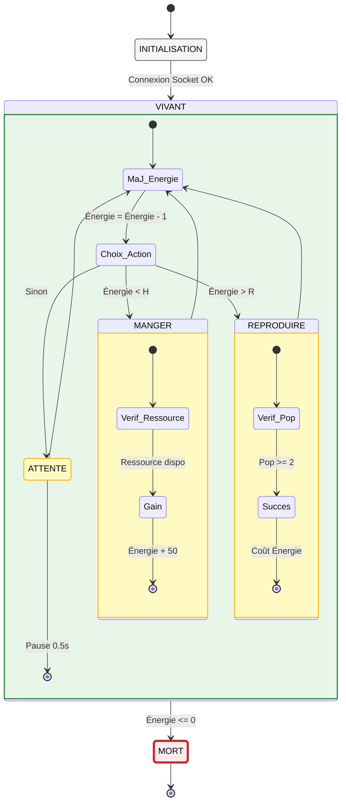

```mermaid
stateDiagram-v2
    direction TB

    [*] --> INITIALISATION
    INITIALISATION --> VIVANT : Connexion Socket OK

    state VIVANT {
        [*] --> MaJ_Energie
        MaJ_Energie --> Choix_Action : Énergie = Énergie - 1
        
        state Choix_Action <<choice>>
        Choix_Action --> MANGER : Énergie < H
        Choix_Action --> REPRODUIRE : Énergie > R
        Choix_Action --> ATTENTE : Sinon
        
        state MANGER {
            [*] --> Verif_Ressource
            Verif_Ressource --> Gain : Ressource dispo
            Gain --> [*] : Énergie + 50
        }

        state REPRODUIRE {
            [*] --> Verif_Pop
            Verif_Pop --> Succes : Pop >= 2
            Succes --> [*] : Coût Énergie
        }

        ATTENTE --> [*] : Pause 0.5s

        MANGER --> MaJ_Energie
        REPRODUIRE --> MaJ_Energie
        ATTENTE --> MaJ_Energie
    }

    VIVANT --> MORT : Énergie <= 0
    MORT --> [*]

    %% Styles et Couleurs (Texte noir, contours épais)
    classDef initial fill:#f5f5f5,stroke:#333,color:black
    classDef vivant fill:#e8f5e9,stroke:#2e7d32,stroke-width:2px,color:black
    classDef action fill:#fff9c4,stroke:#fbc02d,stroke-width:2px,color:black
    classDef mort fill:#ffebee,stroke:#c62828,stroke-width:4px,color:black

    class INITIALISATION initial
    class VIVANT vivant
    class MANGER, REPRODUIRE, ATTENTE action
    class MORT mort
```

