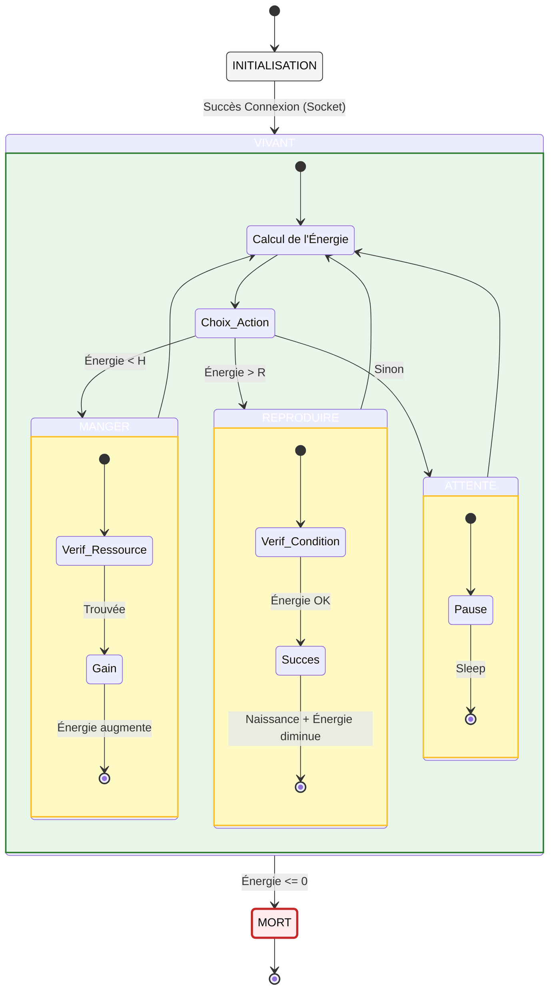

```mermaid
stateDiagram-v2
    direction TB

    %% --- STYLE GÉNÉRAL ---
    classDef initial fill:#f5f5f5,stroke:#333,color:black
    classDef vivant fill:#e8f5e9,stroke:#2e7d32,stroke-width:2px,color:white
    classDef action fill:#fff9c4,stroke:#fbc02d,stroke-width:2px,color:white
    classDef mort fill:#ffebee,stroke:#c62828,stroke-width:3px,color:black

    [*] --> INITIALISATION
    INITIALISATION --> VIVANT : Succès Connexion (Socket)

    state VIVANT {
        [*] --> MaJ_Energie
        
        state "Calcul de l'Énergie" as MaJ_Energie
        
        MaJ_Energie --> Choix_Action

        state Choix_Action <<choice>>
        Choix_Action --> MANGER : Énergie < H
        Choix_Action --> REPRODUIRE : Énergie > R
        Choix_Action --> ATTENTE : Sinon

        %% --- SOUS-ÉTAT : MANGER ---
        state MANGER {
            [*] --> Verif_Ressource
            Verif_Ressource --> Gain : Trouvée
            Gain --> [*] : Énergie augmente
        }

        %% --- SOUS-ÉTAT : REPRODUIRE ---
        state REPRODUIRE {
            [*] --> Verif_Condition
            Verif_Condition --> Succes : Énergie OK
            Succes --> [*] : Naissance + Énergie diminue
        }

        %% --- SOUS-ÉTAT : ATTENTE ---
        state ATTENTE {
            [*] --> Pause
            Pause --> [*] : Sleep
        }

        MANGER --> MaJ_Energie
        REPRODUIRE --> MaJ_Energie
        ATTENTE --> MaJ_Energie
    }

    VIVANT --> MORT : Énergie <= 0
    MORT --> [*]

    %% --- APPLICATION DES STYLES ---
    class INITIALISATION initial
    class VIVANT vivant
    class MANGER, REPRODUIRE, ATTENTE action
    class MORT mort
```
